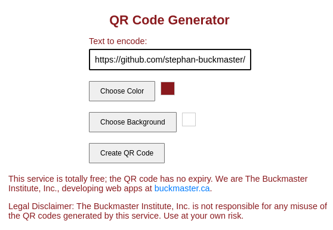
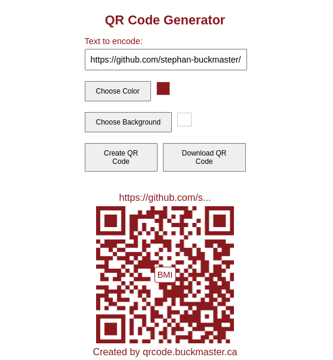

# QR Code Generator

This is a React application that allows users to create QR codes. The application can be deployed as static HTML and JavaScript files. It consists of a single page with a form that includes:

1. **Text to Encode**: Input field for the text or URL to be encoded into a QR code.
2. **Color Pickers**: Options to customize the QR code's foreground and background colors.
3. **Create Button**: A button to generate the QR code based on the provided input and selected colors.

Once the QR code is created, it can be downloaded to the user's device.


## Example Usage

Below is an example of how the application works by encoding the URL of this GitHub repository.

### Before Encoding



### After Encoding



## Installation

1. Clone the repository:
   ```bash
   git clone https://github.com/stephan-buckmaster/qr-code-generator.git 
   ```
2. Navigate to the project directory:
   ```bash
   cd qr-code-generator
   ```
3. Install dependencies:
   ```bash
   npm install
   ```

## Usage

1. Start the development server:
   ```bash
   npm start
   ```
2. Open your browser and go to `http://localhost:3000` to use the application.

## Testing

To run the tests, use the following command:
```bash
npm test
```

## Deployment

To deploy the application as static files, follow these steps:

1. Build the application:
   ```bash
   npm run build
   ```

   This will create a `build` directory containing the static files.

2. Deploy the contents of the `build` directory to your preferred hosting service. This could be a service like GitHub Pages, Netlify, Vercel, or any other static site hosting provider.

3. Follow the specific instructions of your hosting service to complete the deployment process.
